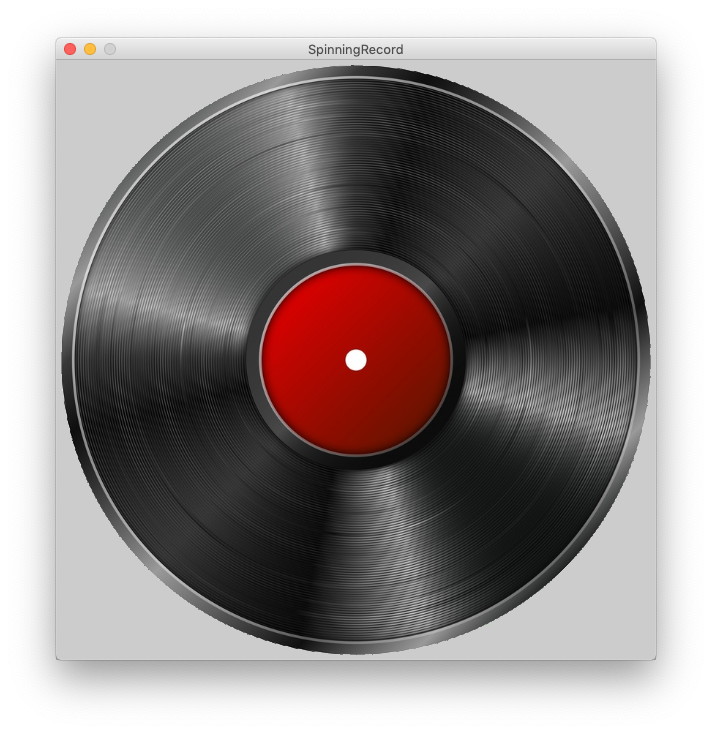

# 01 Methods

{{ forkrepo(fm_level, fm_module) }}

{{ reporef(fm_level, fm_module) }}


## Houses

{{ javaref(fm_level, fm_module,fm_lesson,fm_assignment, fm_dir) }}


1. Have a robot start on the left side of the window near the bottom.

2. Draw a flat-topped house of height 100 with grass after it (see picture).

3. Extract the piece of code that draws the house into a method. Draw 10 houses.

4. Change the method to take (int height) as a parameter. Draw 9 houses of different heights

5. Make the method take a String instead of an int.

6. Make the method take a color as well as a height. The houses are drawn in that color.

[optional] Set the scene to night by setting the background to black

7. Give the houses peaked roofs

8. Extract that roof code into a method “drawPointyRoof” and create a new method: “drawFlatRoof”.

9. Make large houses have flat roofs


## Spinning Record

{{ javaref(fm_level, fm_module,fm_lesson,fm_assignment, fm_dir) }}



We are going to make a virtual record player that spins and plays your song when you click on it.
1. Use the given record.png image or find your own image of a record.

i) If using your own image, copy the file onto the /images folder.
ii) Load the image into your code using the code below:
```
	PImage pictureOfRecord;                        //as member variable
        size(600,600);                                 //in setup method
        pictureOfRecord= loadImage("record.png");      //in setup method
        image(pictureOfRecord, xPosition, yPosition);  //in draw method
```
2. Set the size of your image to match the size of your canvas (after you have loaded it).
```
        pictureOfRecord.resize(height,width);     //in setup method
```
3. Use this method to rotate your image. Make sure you use the image() command after you call rotateImage().
```
   void rotateImage(PImage image, int amountToRotate) {
        translate(width/2, height/2);
        rotate(amountToRotate*TWO_PI/360);
        translate(-image.width/2, -image.height/2);
    }
```
5. Adjust the speed of the record player. Make the record spin.
i) Make a variable to keep track of the image angle.
ii) Increase this variable in the draw method.
iii) Use this variable when you call the rotateImage() method.
6. Only spin the record when the user clicks the mouse button. Hint: use mousePressed
7. Add a song.  Use the sound file already in the project, awesomeTrack.mp3, or add a different one.
8. Only play the song when the mouse is pressed. Hint: use the method below.
```

    song.play()
```
9. Make the record spin as fast as possible


## Rain Game

{{ javaref(fm_level, fm_module,fm_lesson,fm_assignment, fm_dir) }}


1. Start a new sketch with draw, setup, and settings methods.

2. Set your canvas size in the settings() method
```
    size(width, height)
```
and your background color in the draw method
```
    background(red, green, blue)
```
3. Draw a raindrop at the top of the screen in the draw() method.
```

    fill(red, green, blue);
    stroke(red, green, blue);
    ellipse(x, y, width, height);
```
4. Make the rain fall down the screen.
Hint: make a variable for the raindrop's Y position and change it in the draw method.
5. When the rain falls off the bottom of the canvas, start a new rain drop falling from the top.
6.  Make the rain start at a random position (X position) at the top. This code will give you a random number between 0 and the width of your sketch.
```
      int randomNumber = (int) random(width);
```
7. Draw a bucket at the bottom of the screen.
```
        rect(int x, int y, int width, int height);
```
8. Make the bucket move over and back with the mouse. Hint: mouseX
9. Add an int variable to hold the score (above the setup method). If the rain falls in the bucket increase the score by 1. If it doesn’t, decrease the score by 1, but don’t let the score go negative. Figure it out by yourself or use this method…

void checkCatch(int x){
if (x > mouseX && x < mouseX+100)
score++;
else if (score > 0)
score--;
println("Your score is now: " + score);
}

10. Print the score on the screen.

fill(0, 0, 0);
textSize(16);
text("Score: " + score, 20, 20);


## Magic Worms

{{ javaref(fm_level, fm_module,fm_lesson,fm_assignment, fm_dir) }}


1. Start a new sketch with draw, setup, and settings methods.

2. Set your canvas size and background color in the settings() method
```
    size(width, height
    background(red, green, blue)
```
3. In your draw method, use a for loop to draw 300 ellipses in a diagonal line across the canvas.
RUN THE PROGRAM TO CHECK IT.
4. Now change the x and y location of each ellipse to "different" random numbers that are inside the canvas. Note: random() returns values that are type float so your x and y variable types should also be float.
RUN THE PROGRAM TO CHECK IT.
```
   random(int maxValue)
```
5. Set the color of each ellipse.
RUN THE PROGRAM TO CHECK IT.
```
    fill(red, green, blue)
```
6.  If this code isn't already in your file, paste this code at the bottom.
```
    float frequency = .001;
    float noiseInterval = PI;

    void makeMagical() {
        fill( 0, 0, 0, 10 );
        rect(0, 0, width, height);
        noStroke();
    }

    float getWormX(int i) {
        return map(noise(i*noiseInterval + frameCount * frequency), 0, 1, 0, width);
    }

    float getWormY(int i) {
        return map(noise(i*noiseInterval+1 + frameCount * frequency), 0, 1, 0, height);
    }
```
7. Now change the x and y location of each ellipse to the value returned by the getWormX() and getWormY() methods (use the for loop variable as the parameter to these methods).
RUN THE PROGRAM TO CHECK IT.
8. Call makeMagical() in your draw method before the for loop.  OPTIONS: Pass in frameCount or another variable for the ellipse "red value", and i as the "green value" for some extra color coolness.
RUN THE PROGRAM TO CHECK IT.
10. You can adjust the frequency and noiseInterval variables to your liking. Also play with the number and size of particles (ellipses) until it looks amazing.
11. [Optional] Add another worm every time the user clicks the mouse.


## Flappy Bird

{{ javaref(fm_level, fm_module,fm_lesson,fm_assignment, fm_dir) }}


1. Start a new sketch with draw and setup methods.

2. Set your canvas size in the setup method
size(width, height)
3. In your draw method, set a background, and draw a ball (bird) on the screen.
```
background(red, green, blue);
fill(red, green, blue);
stroke(red, green, blue);
ellipse(x, y, width, height);
```
4. Make the bird fall down
Hint: make variables for the bird's X and Y position and use them for the ellipse in the draw method.
5. Add velocity to the bird.
Hint: make a variable for the velocity of the bird in the Y direction (up). Changing its value should change the velocity of your bird.
int birdYVelocity = -10;
6.  Give the bird gravity.
Hint: make a variable for the gravity pulling the bird down. Gravity should continually increase the value of birdYVelocity.
int gravity = 1;
7. Make the bird jump (flap) when the mouse is clicked.
Hint: construct a mousePressed() method the same way setup() and draw() were made.
In this method, reset the bird’s velocity to make the bird rise.
8.  Draw a pipe coming down from the top of the sketch.

In the draw() method:
fill(red, green, blue);
rect(x, y, width, height);
9. Make the pipe move from right to left.

Hint: make a variable for the pipe X position and change it in the draw method.
10. Make the pipe teleport back to the right side of the screen once it has passed through the left. This will simulate the repeating pipes coming from the right of the screen.
Tip: Put this code into a teleportPipes() method and you can also call it from the setup() method to create the first pipes.
11. Set the upper pipe's height to a new random number each time it teleports
int upperPipeHeight = (int) random(100, 400);
12. Create a variable, pipeGap, to represent the gap between the pipes. Make sure the gap is big enough for the ball to go through. The gap between the pipes will not change.
13. Make a second pipe that will go down to the bottom of the sketch, leaving a space between the two pipes that is the size of the gap (see step 12). Make sure both pipes use the same value for their x position. Set the lower pipe y value by adding the upper pipe height and pipe gap. Ex:
lowerY = upperPipeHeight + pipeGap;
14. Make the game end when the bird hits the pipe. Figure it out by yourself, or use this method:
```
boolean intersectsPipes() { 
         if (birdY < upperPipeHeight && birdX > pipeX && birdX < (pipeX+pipeWidth)){
            return true; }
        else if (birdY>lowerPipeTop && birdX > pipeX && birdX < (pipeX+pipeWidth)) {
            return true; }
        else { return false; }
}
```
15. End the game when the bird hits the ground.
Make a rectangle for the ground.
Use a boolean variable at the top of the sketch to indicate if game has ended.
17.  Create a score and make it increase each time the bird passes through a pipe.
text(text, xPosition, yPosition);
18. OPTIONAL.   Use images for the background, pipes and bird (see image at top). You can find your own images, or those provided in the Module 3 Java project. See below for code snippets to load and draw images.

PImage back;
PImage pipeBottom;
PImage pipeTop;
PImage bird;
void setup() {
back = loadImage("flappyBackground.jpg");
pipeBottom = loadImage("bottomPipe.png");
pipeTop = loadImage("topPipe.png");
bird = loadImage("bird.png");
bird.resize(50,50);
}
void draw() {
background(back);
image (pipeBottom,250,375);
image (pipeTop,250,-130);
image (bird, 250, 300);
}

