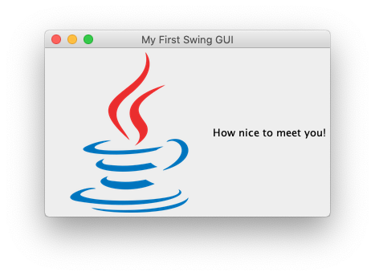
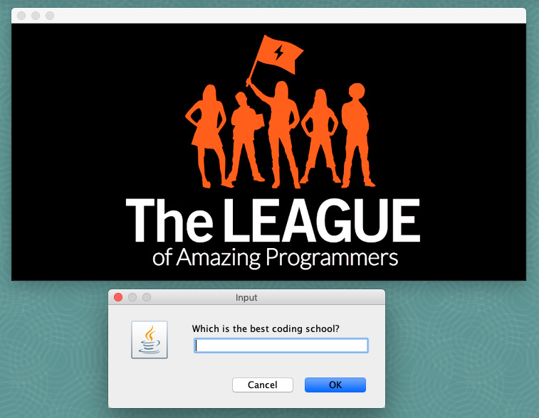
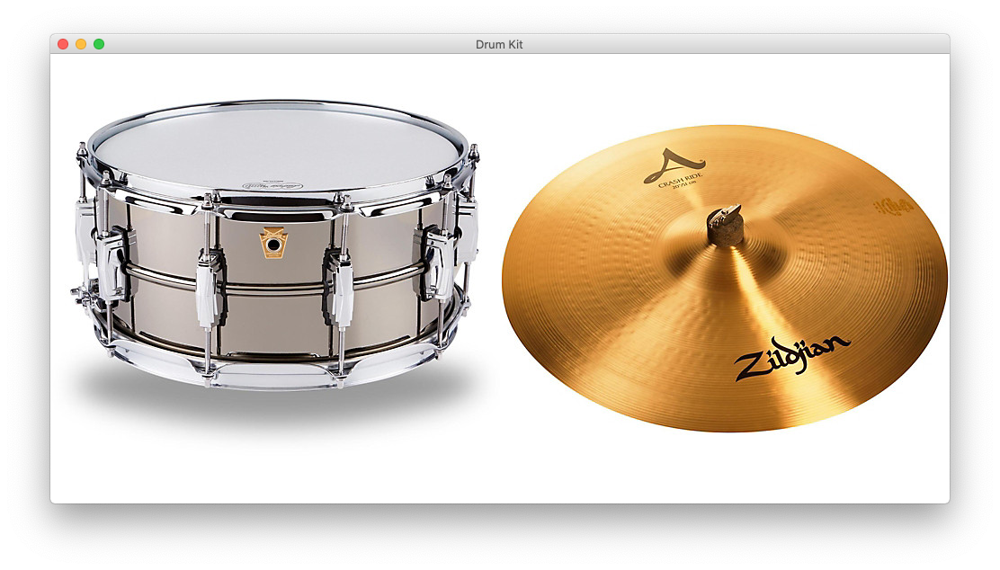
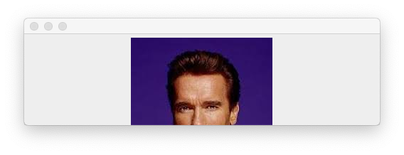
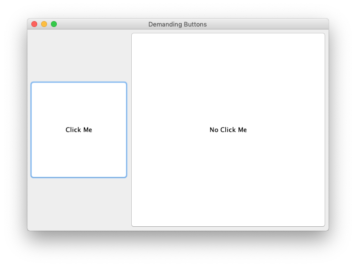

# 03 Gui With Help

{{ forkrepo(fm_level, fm_module) }}

{{ reporef(fm_level, fm_module) }}

## My First Swing GUI

{{ javaref(fm_level, fm_module,fm_lesson,fm_assignment, fm_dir) }}

### Goal:

We are going to make a simple GUI (pronounced gooey). GUI stands for Graphical User Interface, which in this case means a window and everything that is drawn on it. The user will see a window (frame) with a greeting and image similar to the one shown above.

### Steps:

1. Create a JFrame. A JFrame is a window that has a border and title. It will contain one component of your GUI. In this program, it will contain a JPanel (see next). JFrames are invisible when you create them, so you will need to make it visible (follow instructions in the code).
2. Create a JPanel and add it to the JFrame. A JPanel is a simple container that provides space for your program to add more components. In this program, it will contain a JLabel (see next).
3. Create a JLabel and add it to the JPanel. A JLabel allows you to display small amounts of text, and/or an image. In this program, both will be displayed (follow instructions in the code).
4. Packing a JFrame causes it to resize itself so that the its components are visible. If you do anything to change the size of its contents, a JFrame should be packed again.

## Photo Quiz

{{ javaref(fm_level, fm_module,fm_lesson,fm_assignment, fm_dir) }}

### Goal:

We are going to use GUI components to make quiz that shows images to the player and asks them questions relating to the images they see.

### Steps:

1. Create a JFrame. A JFrame is a window that has a border and title. JFrames are invisible when you create them, so you will need to make it visible (follow instructions in the code).
2. Create a Component. Call the method provided, to put an image (icon) into the Component (follow instructions in the code).
3. Add the Component to the JFrame (follow instructions in the code).
4. Packing a JFrame causes it to resize itself so that its components are visible. If you do anything to change the size of its contents, a JFrame should be packed again.
5. Use a pop-up to ask the user a question relating to the image and tell them if they get the right answer.
6. Replace the Component with another that has a different image and ask a new question (follow instructions in the code).

## Drum Kit

{{ javaref(fm_level, fm_module,fm_lesson,fm_assignment, fm_dir) }}

### Goal:

We are going to use GUI components to make drum kit. When different images of the drum kit are clicked, they will play appropriate sounds.

### Steps:

1. Create a JFrame. A JFrame is a window that has a border and title. It will contain one component of your GUI. In this program, it will contain a JPanel (see next). JFrames are invisible when you create them, so you will need to make it visible (follow instructions in the code).
2. Create a JPanel and add it to the JFrame.
3. Create a JLabel that shows the image of a drum (follow instructions in the code) and add it to the JPanel.

Packing a JFrame causes it to resize itself so that its components are visible. If you do anything to change the size of its contents, a JFrame should be packed again.
When you run the program you should see the drum
4. Packing a JFrame causes it to resize itself so that its components are visible. If you do anything to change the size of its contents, a JFrame should be packed again.
5. When you run the program you should see the drum
6. Add a MouseListener to the JLabel and complete the mouseClicked() method so that a drum sound is played when the drum image is clicked (follow instructions in the code).
7. Repeat the above steps for a second JLabel that shows the image of a cymbal (follow instructions in the code).
8. Your drum kit is complete!

## Body Part Quiz

{{ javaref(fm_level, fm_module,fm_lesson,fm_assignment, fm_dir) }}

### Goal:

We are going to use GUI components to make a quiz in which only part of an image is displayed (like the one shown above). The player has to guess the name of each celebrity shown.

### Steps:

1. The program already contains a JFrame and JPanel. There is also a selection of celebrity photos which you can use for the quiz (or replace them with your own selection).
2. Your challenge is to resize the frame so that only part of the celebrity's face is shown.
3. Ask the user to guess who each person is and keep a score of how many they get correct.

End the program when there are no more images to display.
4. End the program when there are no more images to display.

## Duelling Buttons

{{ javaref(fm_level, fm_module,fm_lesson,fm_assignment, fm_dir) }}

### Goal:

We are going to use GUI components to make demanding buttons that will compete in a duel for the uer's attention. When the user clicks on one button, the other button will demand to be clicked on!

### Steps:

1. A JFrame, JPanel, and two JButtons have already been created. You set the text of both buttons to "Click Me". When you pack the JFrame and run the program, it should look like this:
2. Add this ActionListener to both buttons. Then modify the actionPerformed() method to make the buttons change their text and size when the user clicks (follow instructions in the code).

